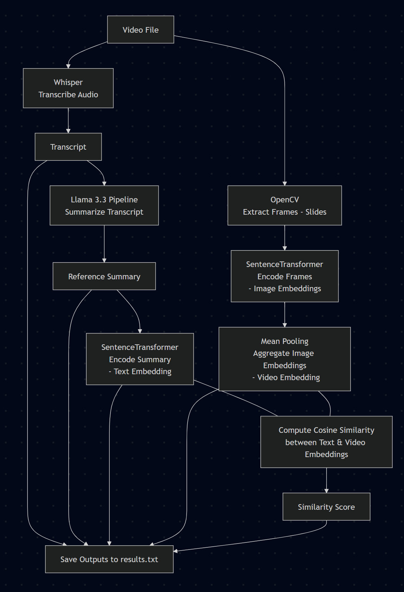

Separate audio and video research into different folders

Build the conda environment from visual.yml 

```
conda create --name visual python=3.10 -y
```

```
cd visual_research
```

```
pip3 install -r requirements.txt
```

Test with LLAMA 4 (Make sure you have your key for the gated model)

Execute:

```
python3 run_from_video_LLAMA_4.py
```

----------------

Check the [PROPOSAL](./Proposal.md) if you are "reader type". Otherwise:

