Separate audio and video research into different folders

Build the conda environment from visual.yml 

```
conda env create -f visual.yaml
```

```
cd visual_research
```

```
pip3 install -r requirements.txt
```

Test with LLAMA 4 (Make sure you have your key for the gated model)

Execute:

```
python3 run_from_video_LLAMA_4.py
```

----------------

Check the [proposal](./Proposal.md) if you are the "reader type". If you like it quick and dirty, take a look at the diagram:

